# EditP23: 3D Editing via Propagation of Image Prompts to Multi-View

[](https://editp23.github.io/)
[](https://arxiv.org/abs/2506.20652)

This repository contains the official implementation for **EditP23**, a method for fast, mask-free 3D editing that propagates 2D image edits to multi-view representations in a 3D-consistent manner.
The edit is guided by an image pair, allowing users to leverage any preferred 2D editing tool, from manual painting to generative pipelines.

### Installation
<details>
<summary>Click to expand installation instructions</summary>

This project was tested on a Linux system with Python 3.11 and CUDA 12.6.

**1. Clone the Repository**
```bash
git clone https://github.com/editp23/EditP23.git
cd EditP23
```

**2. Install Dependencies**
```bash
conda create -n editp23 python=3.11 -y
conda activate editp23
pip install torch torchvision --index-url https://download.pytorch.org/whl/cu126 # Ensure compatibility with your CUDA version. (tested with torch 2.6, cuda 12.6)
pip install diffusers==0.30.1 transformers accelerate pillow huggingface_hub numpy tqdm
```

</details>

### Quick Start

**1. Prepare Your Experiment Directory**

Create a directory for your experiment. Inside this directory, you must place three specific PNG files:

* `src.png`: The original, unedited view of your object.
* `edited.png`: The same view after you have applied your desired 2D edit.
* `src_mv.png`: The multi-view grid of the original object, which will be edited.

Your directory structure should look like this:
```text
examples/
└── robot_sunglasses/
    ├── src.png
    ├── edited.png
    └── src_mv.png
```

**2. Run the Editing Script**

Execute the `main.py` script, pointing it to your experiment directory. You can adjust the guidance parameters based on the complexity of your edit.

#### Execution Examples

* **Mild Edit (Appearance Change):**
    ```bash
    python src/main.py --exp_dir examples/robot_sunglasses --tar_guidance_scale 5.0 --n_max 31
    ```
* **Hard Edit (Large Geometry Change):**
    ```bash
    python src/main.py --exp_dir examples/deer_wings --tar_guidance_scale 21.0 --n_max 39
    ```

The output will be saved in the `output/` subdirectory within your experiment folder.

### Command-Line Arguments

* `--exp_dir`: (Required) Path to the experiment directory.
* `--T_steps`: Total number of denoising steps. Default: `50`.
* `--n_max`: The number of denoising steps to apply edit-aware guidance. Higher values can help with more complex edits. Default: `31`. This value shouldn't exceed `T_steps`.
* `--src_guidance_scale`: CFG scale for the source condition. Can typically remain constant. Default: `3.5`.
* `--tar_guidance_scale`: CFG scale for the target (edited) condition. Higher values apply the edit more strongly. Default: `5.0`.
* `--seed`: Random seed for reproducibility. Default: `18`.


# Results in Multi-View

### Deer - Pixar style & Wings

| |                            Cond. View                             |                        View 1                        |                        View 2                        |                        View 3                        |
| :--- |:-----------------------------------------------------------------:|:----------------------------------------------------:|:----------------------------------------------------:|:----------------------------------------------------:|
| **Original** | 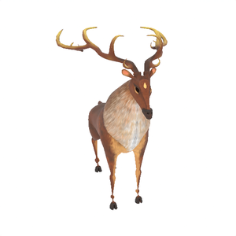 | 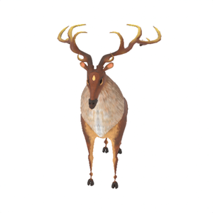 | 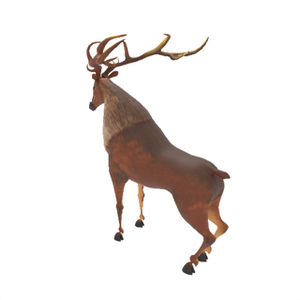 | 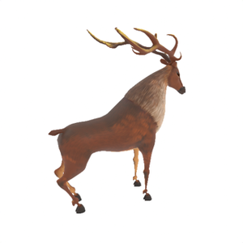 |
| **Pixar style** |  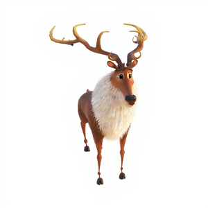  |  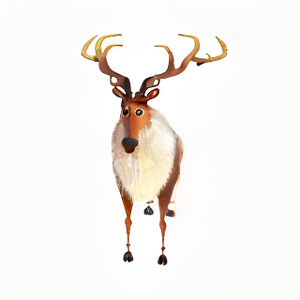  |  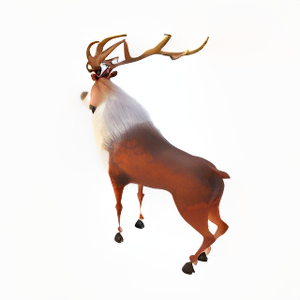  |  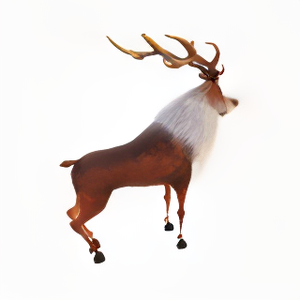  |
| **Wings** | 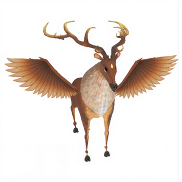  | 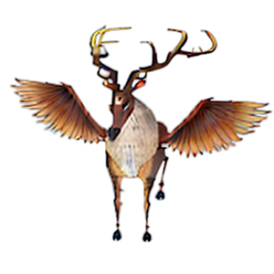  | 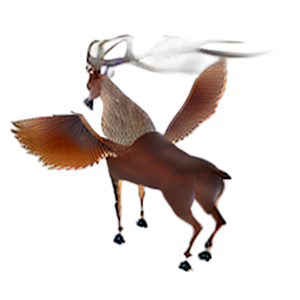  | 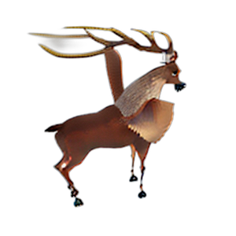  |

<br>

### Person - Old & Zombie

|              |                            Cond. View                             |                        View 1                        |                        View 2                        |                        View 3                        |
|:-------------|:-----------------------------------------------------------------:|:----------------------------------------------------:|:----------------------------------------------------:|:----------------------------------------------------:|
| **Original** | 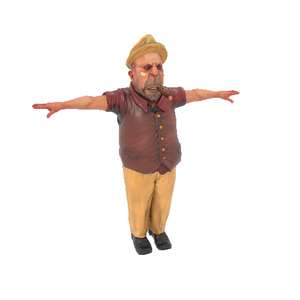 |  | 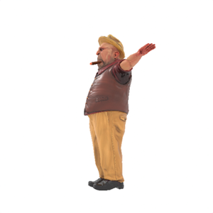 | 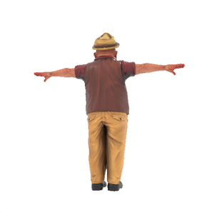 |
| **Old**      |  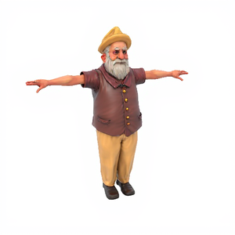  |  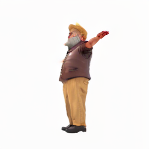  |  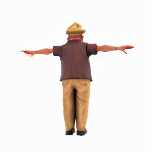  |  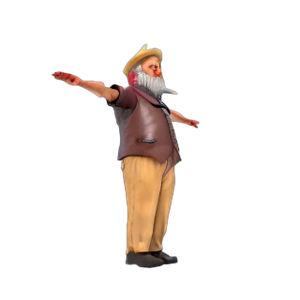  |
| **Zombie**   | 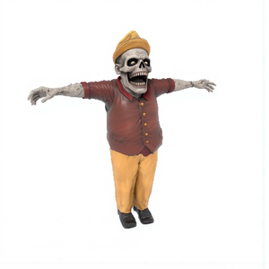  | 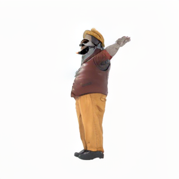  | 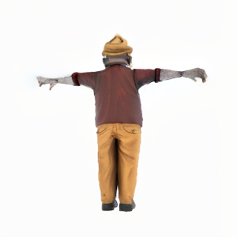  | 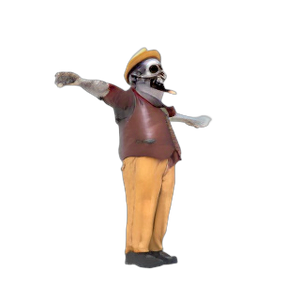  |


# Project Structure
The repository is organized as follows:
```text
EditP23/
├── examples/              # Example assets for quick testing
│   ├── deer_wings/
│   │   ├── src.png
│   │   ├── edited.png
│   │   └── src_mv.png
│   └── robot_sunglasses/
│       └── ...
├── assets/                # Raw asset files
│   └── stormtrooper.glb
├── scripts/               # Helper scripts for data preparation
│   ├── render_mesh.py
│   └── img2mv.py
├── src/                   # Main source code
│   ├── init.py
│   ├── edit_mv.py
│   ├── main.py
│   ├── pipeline.py
│   └── utils.py
├── .gitignore
└── README.md
```

# Utilities

## Setup

This guide shows how to prepare inputs for **EditP23** and run an edit.

These helper scripts create the three PNG files every experiment needs:

| File          | Purpose                                                         |
|---------------|-----------------------------------------------------------------|
| `src.png`     | Original single view (the one you will edit).                   |
| `edited.png`  | Your 2D edit of `src.png`.                                      |
| `src_mv.png`  | 6-view grid of the unedited object (used for propagation).      |

### 1. Generate `src.png` and `src_mv.png`
**EditP23** needs a **source view** (`src.png`) and a **multi-view grid** (`src_mv.png`).  
The grid contains six extra views at fixed azimuth/elevation pairs:
Angles (azimuth, elevation): `(30°, 20°) (90°, -10°) (150°, 20°) (210°, -10°) (270°, 20°) (330°, -10°)` and for the prompt view `(0°, 20°)`.
We provide two methods to generate these inputs. Both methods produce views on a clean, white background.
Both methods below produce the multi-view grid and the source view from the relevant angles on a white background.

#### Method A: From a Single Image

You can generate the multi-view grid from a single image of an object using our `img2mv.py` script. This script leverages the Zero123++ pipeline with a checkpoint from InstantMesh, which is fine-tuned to produce white backgrounds.

```bash
# This script takes a single input image and generates the corresponding multi-view grid.
python scripts/img2mv.py \
  --input_image "examples/robot_sunglasses/src.png" \
  --output_dir "examples/robot_sunglasses/"
```
**Note:** In this case, `src.png` serves as the source view for EditP23.


#### Method B: From a 3D Mesh
If you have a 3D model, you can use our Blender script to render both the source view and the multi-view grid.
**Prerequisite:** This script requires Blender (`pip install bpy`).

```bash
# This script renders a source view and a multi-view grid from a 3D mesh.
python scripts/render_mesh.py \
  --mesh_path "assets/stormtrooper.glb" \
  --output_dir "examples/stormtrooper/"
```

### 2. Generating `edited.png`
Once you have your **source view**, you can use any 2D image editor to make your desired changes. We use this user-provided edit to guide the 3D modification.
For quick edits, you can use readily available online tools, such as the following HuggingFace Spaces:
- [FlowEdit](https://huggingface.co/spaces/fallenshock/FlowEdit): Excellent for global, structural edits.
- [Flux-Inpainting](https://huggingface.co/spaces/black-forest-labs/FLUX.1-Fill-dev): Great for local modifications and inpainting.


## Reconstruction
Coming soon.